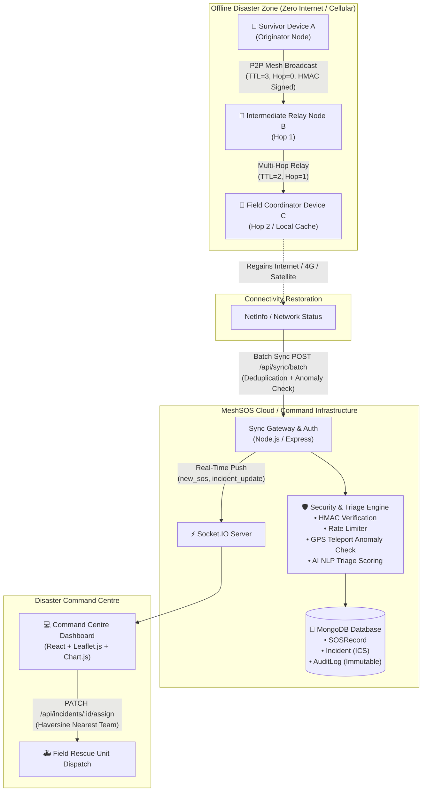
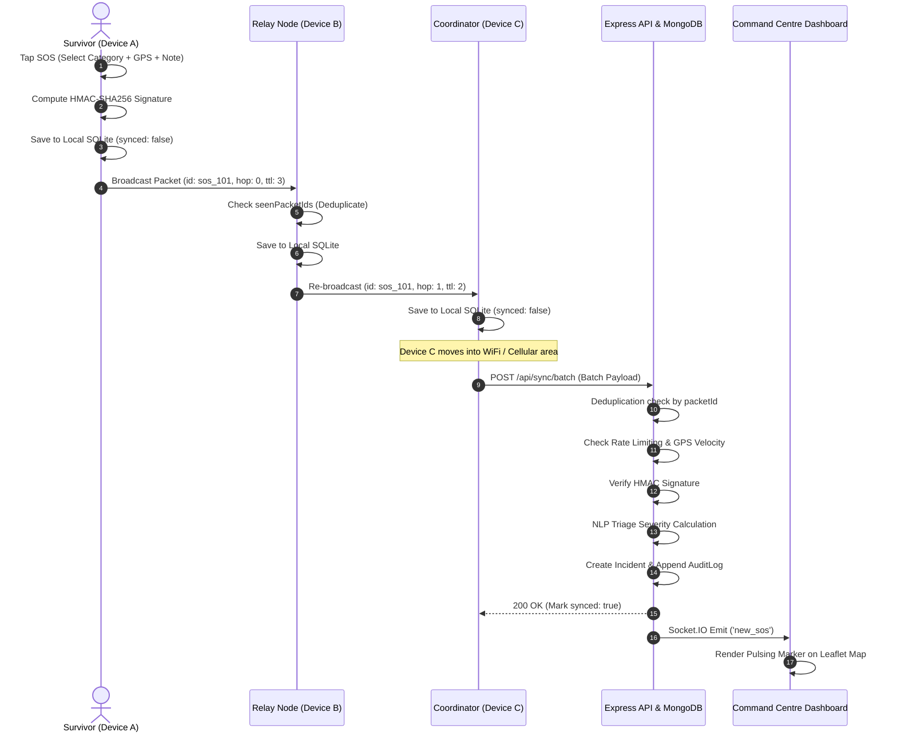
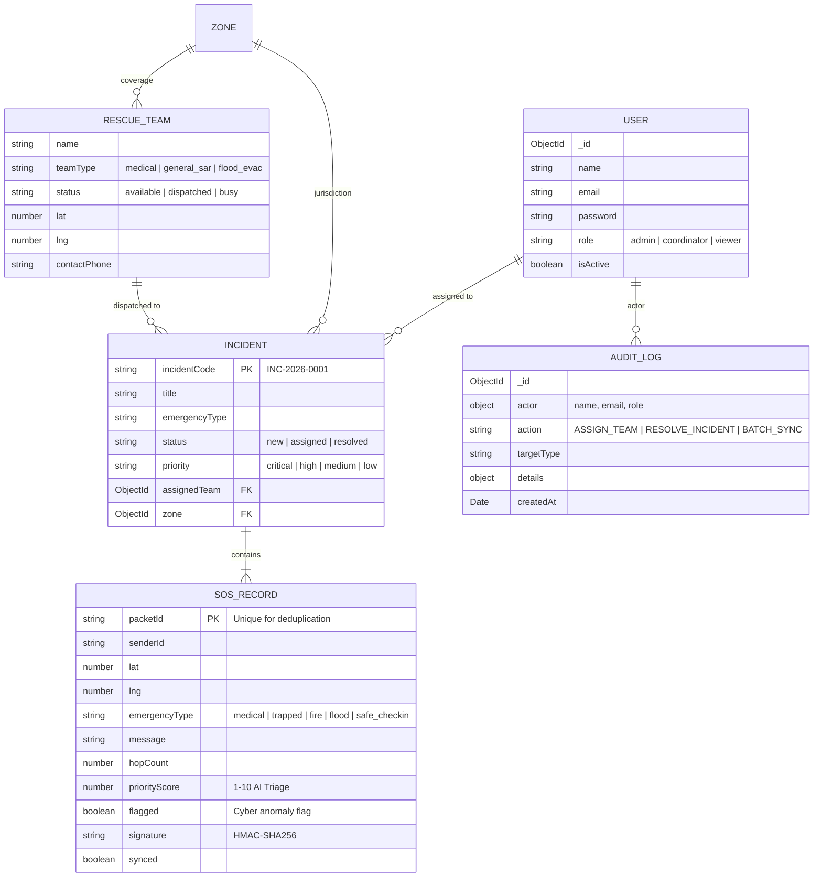

# MeshSOS — System Architecture & Topology

## 1. High-Level Architecture Overview

---

## 2. Multi-Hop Packet Lifecycle & Deduplication Flow

---

## 3. Database Schema Entity-Relationship Diagram

